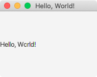
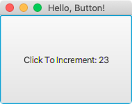
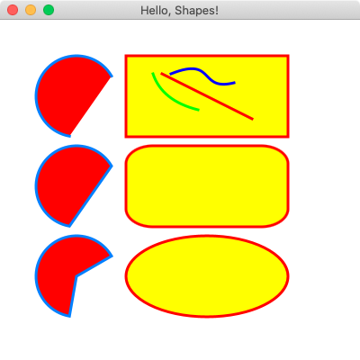

# [](https://github.com/AndyObtiva/glimmer) Glimmer DSL for JFX 0.0.1
## JRuby JavaFX Desktop Development GUI Library
[](http://badge.fury.io/rb/glimmer-dsl-jfx)
[](https://gitter.im/AndyObtiva/glimmer?utm_source=badge&utm_medium=badge&utm_campaign=pr-badge&utm_content=badge)

[Glimmer](https://github.com/AndyObtiva/glimmer) DSL for [JFX](https://openjfx.io/) enables building desktop applications with [JavaFX](https://openjfx.io/) via [JRuby](https://www.jruby.org/).

[JavaFX](https://openjfx.io/) has been Java's next generation technology for a while for desktop application GUI development. Unfortunately, when it divorced itself from its [JavaFX Script](https://en.wikipedia.org/wiki/JavaFX_Script) roots, it became no better than [Java Swing](https://docs.oracle.com/javase/tutorial/uiswing/) in syntax.

Furthermore, the whole stage and scene production metaphor made everything more complicated to get into it for software engineers who encountered it for the first time. After all, desktop developers simply think of windows, not stages or scenes. The metaphor unfortunately pushes software engineers into thinking of low-level details (e.g. nodes) that are not important in developing business desktop applications.

[FXML](https://openjfx.io/javadoc/17/javafx.fxml/javafx/fxml/doc-files/introduction_to_fxml.html) attempted to rectify the situation by making [JavaFX](https://openjfx.io/) more declarative than its [Swing-like Java syntax](https://docs.oracle.com/javase/tutorial/uiswing/). Unfortunately, XML, like its cousin HTML, brings all the same problems web developers suffer from day-to-day to desktop development, especially multi-language dissonance. That defeated the whole point about desktop development being much simpler and more productive than web development for simple local apps. [FXML](https://openjfx.io/javadoc/17/javafx.fxml/javafx/fxml/doc-files/introduction_to_fxml.html) was really just a step back into the wrong direction.

[Glimmer DSL for JFX](https://rubygems.org/gems/glimmer-dsl-jfx) aims to overcome the hurdles of [JavaFX](https://openjfx.io/) by providing a declarative hierarchical alternative to [FXML](https://openjfx.io/javadoc/17/javafx.fxml/javafx/fxml/doc-files/introduction_to_fxml.html) in pure Ruby as one language (no multi-language mixing dissonance), thus supercharging productivity and maintainability in developing [JavaFX](https://openjfx.io/) applications similarly to [Glimmer DSL for SWT](https://github.com/AndyObtiva/glimmer-dsl-swt) via:
- [Declarative DSL syntax](#glimmer-gui-dsl) that visually maps to the GUI control hierarchy while still allowing View logic in the same language
- Convention over configuration via [smart defaults and automation of low-level details](#smart-defaults-and-conventions)
- Requiring the least amount of syntax possible to build GUI
- Custom control support
- Bidirectional Data-Binding without the complexity of static typing to declaratively wire and automatically synchronize GUI with Business Models
- Scaffolding for new custom components, apps, and gems
- Native-Executable packaging on Mac, Windows, and Linux.

Hello, World!



```ruby
window {
  title 'Hello, World!'
  
  label('Hello, World!')
}
```

NOTE: Glimmer DSL for JFX is currently in early alpha mode (incomplete proof-of-concept). If you want it developed faster, then [open an issue report](https://github.com/AndyObtiva/glimmer-dsl-jfx/issues/new). I have completed some GitHub project features much faster before due to [issue reports](https://github.com/AndyObtiva/glimmer-dsl-jfx/issues) and [pull requests](https://github.com/AndyObtiva/glimmer-dsl-jfx/pulls). Please help make better by contributing, adopting for small or low risk projects, and providing feedback. It is still an early alpha, so the more feedback and issues you report the better.Please help make better by contributing, adopting for small or low risk projects, and providing feedback. It is still an early alpha, so the more feedback and issues you report the better.

Other [Glimmer](https://rubygems.org/gems/glimmer) DSL gems you might be interested in:
- [glimmer-dsl-swt](https://github.com/AndyObtiva/glimmer-dsl-swt): Glimmer DSL for SWT (JRuby Desktop Development GUI Framework)
- [glimmer-dsl-opal](https://github.com/AndyObtiva/glimmer-dsl-opal): Glimmer DSL for Opal (Pure Ruby Web GUI and Auto-Webifier of Desktop Apps)
- [glimmer-dsl-tk](https://github.com/AndyObtiva/glimmer-dsl-tk): Glimmer DSL for Tk (MRI Ruby Desktop Development GUI Library)
- [glimmer-dsl-libui](https://github.com/AndyObtiva/glimmer-dsl-libui): Glimmer DSL for LibUI (Prerequisite-Free Ruby Desktop Development GUI Library)
- [glimmer-dsl-xml](https://github.com/AndyObtiva/glimmer-dsl-xml): Glimmer DSL for XML (& HTML)
- [glimmer-dsl-css](https://github.com/AndyObtiva/glimmer-dsl-css): Glimmer DSL for CSS

## Prerequisites

- JDK 17 (find at https://www.oracle.com/java/technologies/downloads/#java17)
- [RVM](http://rvm.io) on Mac & Linux (not available on Windows)
- JRuby 9.3.1.0 (supporting Ruby 2.6.x syntax) (get via [RVM](http://rvm.io) on Mac and Linux by running `rvm install jruby-9.2.19.0`; On Windows, find at [https://www.jruby.org/download](https://www.jruby.org/download))
- JavaFX 17 Runtime SDK (find at https://gluonhq.com/products/javafx/ choosing the right "SDK" for your platform and CPU architecture. Follow environment variable instructions at https://openjfx.io/openjfx-docs/#install-javafx . Specifically, after download, export/set `PATH_TO_FX` environment variable to path of `lib` directory in extracted "SDK" directory)

## Setup

Make sure to download the right JavaFX SDK for your platform and CPU architecture from https://gluonhq.com/products/javafx/ and then set the PATH_TO_FX environment variable to the location of the lib directory in the extracted SDK directory.

### Option 1: Install

Run this command to install directly:
```
gem install glimmer-dsl-jfx -v0.0.1
```

### Option 2: Bundler

Add the following to `Gemfile`:
```
gem 'glimmer-dsl-jfx', '0.0.1'
```

And, then run:
```
bundle
```

## Usage

Simply require the library and mixin the `Glimmer` module to utilize the [Glimmer GUI DSL](#glimmer-gui-dsl) for JFX:

```ruby
require 'glimmer-dsl-jfx'

include Glimmer

window {
  title 'Hello, World!'
  
  label('Hello, World!')
}
```

For actual application development outside of simple demos, mixin the `Glimmer` module into a custom Ruby application class instead:

```ruby
require 'glimmer-dsl-jfx'

class SomeApplication
  include Glimmer

  def launch
    window {
      title 'Hello, World!'
      
      label('Hello, World!')
    }
  end
end

SomeApplication.new.launch
```

## Glimmer GUI DSL

The Glimmer GUI DSL enables development of desktop graphical user interfaces in a manner similar to HTML, but in one language, Ruby, thus avoiding the multi-language separation dissonance encountered on the web, especially given that Ruby looping/conditional constructs do not need scriptlets to be added around View code. This makes desktop development extremely productive.

1 - Keywords

Always start with `window`, which simplifies/replaces both the `Stage` and `Scene` concepts, having both their properties. Additionally, `window` removes the need to extend `Application` and worry about receiving the primary `Stage` before being able to set the `Scene` and add controls.

Inside `window`, you may declare any [JavaFX](https://openjfx.io/) control with its keyword, which is the underscored version of the class name. For example, `label` is the keyword for `javafx.scene.control.Label`

Examples:

```ruby
v_box
label
button
```

2 - Arguments

You may pass any arguments that a [JavaFX](https://openjfx.io/) control constructor accepts to its Glimmer keyword.

Example (`Label` and `Button` have a constructor signature that accepts a string representing the text property):

```ruby
label('Full Name')
button('Submit Form')
```

The recommended style is to always wrap arguments with parentheses for control keywords.

3 - Content Block

You may pass a content block to any [JavaFX](https://openjfx.io/) control keyword, which contains properties and/or nested controls.

Example:

```ruby
window {
  title 'Hello, Window!'
  width 320
  height 240

  v_box {
    label('Hello, Label!')
    button('Hello, Button!')
  }
}
```

The recommended style for the content block is always curly braces `{}` to denote as View nesting code different from looping/conditional logic, which utilizes `do;end` instead.

Property arguments never have parentheses.

4 - Listeners

You may declare listeners with their `on_`-prefixed event method name as found in the [JavaFX Javadoc](https://www.javadoc.io/doc/org.openjfx/javafx-base/17.0.1/index.html). For example: `on_action`, `on_key_pressed`, `on_key_released`, `on_key_typed`, `on_mouse_clicked`, and `on_mouse_moved`.

For example, `Button` has an `onAction` method. In Glimmer, you simply underscore that:

```ruby
window {
  title 'Hello, Button!'

  button('Click') { |b|
    on_action do
      b.text = 'Clicked'
    end
  }
}
```

The recommended style for listeners is always a `do; end` block.

5 - Component Proxy & Methods

When utilizing the Glimmer GUI DSL, you get back proxy objects that wrap [JavaFX Javadoc](https://www.javadoc.io/doc/org.openjfx/javafx-base/17.0.1/index.html) controls. To access the original control wrapped by the proxy object, you may call the `#jfx` method.

Furthermore, you may invoke any method available on the control indirectly on the proxy object, like the `#text` method on `label`.

```ruby
label1 = label('Full Name')
label1.text # same as label1.jfx.text
```

6 - Observe Model Attributes

In Smalltalk-MVC ([Model View Controller](https://en.wikipedia.org/wiki/Model%E2%80%93view%E2%80%93controller) Architectural Pattern), the View is an active View that observes the Model for changes and updates itself.


This can be achieved with the Glimmer GUI DSL using the `observe` keyword, which takes a model (any object, including `self`) and attribute Symbol or String expression (e.g. `:count` or `'address.street'`).

The model is automatically enhanced as an `Glimmer::DataBinding::ObservableModel` / `Glimmer::DataBinding::ObservableHash` / `Glimmer::DataBinding::ObservableArray` depending on its type to support notifying observers of attribute changes (when performed using the attribute writer, which automatically calls added method `notify_observers(attribute)`)

Note that it is usually recommended to observe external model objects (not `self`), but `self` is OK in very simple cases or presentation-related attributes only.

Example:

```ruby
require 'glimmer-dsl-jfx'

class Counter
  attr_accessor :count

  def initialize
    self.count = 0
  end
end

class HelloButton
  include Glimmer
  
  def initialize
    @counter = Counter.new

    observe(@counter, :count) do |new_count|
      @button.text = "Click To Increment: #{new_count}"
    end
  end
  
  def launch
    window {
      title 'Hello, Button!'
      
      @button = button('Click To Increment: 0') {
        on_action do
          @counter.count += 1
        end
      }
    }
  end
end

HelloButton.new.launch
```



## Smart Defaults and Conventions

- `window` automatically builds a primary `Stage` object, sets `Stage` properties and sets a `Scene` in primary stage.

## Girb (Glimmer IRB)

You can run the `girb` command (`bin/girb` if you cloned the project locally):

```
girb
```

This gives you `irb` with the `glimmer-dsl-jfx` gem loaded and the `Glimmer` module mixed into the main object for easy experimentation with GUI.

## Samples

### Hello Samples

#### Hello, World!

Run with gem installed:

```
jruby -r glimmer-dsl-jfx -e "require 'samples/hello/hello_world'"
```

Or run from locally cloned project directory:

```
jruby -r ./lib/glimmer-dsl-jfx samples/hello/hello_world.rb
```


[samples/hello/hello_world.rb](samples/hello/hello_world.rb):

```ruby
require 'glimmer-dsl-jfx'

include Glimmer

window {
  title 'Hello, World!'
  
  label('Hello, World!')
}
```

#### Hello, Button!

Run with gem installed:

```
jruby -r glimmer-dsl-jfx -e "require 'samples/hello/hello_button'"
```

Or run from locally cloned project directory:

```
jruby -r ./lib/glimmer-dsl-jfx samples/hello/hello_button.rb
```


Version 1 (without model) - [samples/hello/hello_button.rb](samples/hello/hello_button.rb):

```ruby
require 'glimmer-dsl-jfx'

include Glimmer

window {
  title 'Hello, Button!'
  
  @button = button('Click To Increment: 0') {
    on_action do
      button_text_match = @button.text.match(/([^0-9]+)(\d+)$/)
      count = button_text_match[2].to_i + 1
      @button.text = "#{button_text_match[1]}#{count}"
    end
  }
}
```

Version 2 (with model) - [samples/hello/hello_button2.rb](samples/hello/hello_button2.rb):

```ruby
require 'glimmer-dsl-jfx'

class Counter
  attr_accessor :count

  def initialize
    self.count = 0
  end
end

class HelloButton
  include Glimmer
  
  def initialize
    @counter = Counter.new
  end
  
  def launch
    window {
      title 'Hello, Button!'
      
      @button = button('Click To Increment: 0') {
        on_action do
          @counter.count += 1
          @button.text = "Click To Increment: #{new_count}"
        end
      }
    }
  end
end

HelloButton.new.launch
```

#### Hello, Shapes!

This sample is not included in the Ruby gem.

Run from locally cloned project directory:

```
jruby -r ./lib/glimmer-dsl-jfx samples/hello/hello_button.rb
```



[samples/hello/hello_shapes.rb](samples/hello/hello_shapes.rb):

```ruby
require 'glimmer-dsl-jfx'

include Glimmer

window {
  title 'Hello, Shapes!'
  width 400
  height 400
  
  pane {
    arc(85, 85, 45, 45, 30, 230) {
      type ArcType::OPEN
      fill Paint.value_of('#ff0000')
      stroke Paint.value_of('#0080ff')
      stroke_width 3
    }

    arc(85, 185, 45, 45, 30, 230) {
      type ArcType::CHORD
      fill Paint.value_of('#ff0000')
      stroke Paint.value_of('#0080ff')
      stroke_width 3
    }

    arc(85, 285, 45, 45, 30, 230) {
      type ArcType::ROUND
      fill Paint.value_of('#ff0000')
      stroke Paint.value_of('#0080ff')
      stroke_width 3
    }

    rectangle(140, 40, 180, 90) {
      fill Paint.value_of('#ffff00')
      stroke Paint.value_of('#ff0000')
      stroke_width 3
    }

    rectangle(140, 140, 180, 90) {
      arc_width 60
      arc_height 40
      fill Paint.value_of('#ffff00')
      stroke Paint.value_of('#ff0000')
      stroke_width 3
    }

    ellipse(230, 285, 90, 45) {
      fill Paint.value_of('#ffff00')
      stroke Paint.value_of('#ff0000')
      stroke_width 3
    }

    line(180, 60, 280, 110) {
      stroke Paint.value_of('#ff0000')
      stroke_width 3
    }

    quad_curve(170, 60, 180, 90, 220, 100) {
      fill Paint.value_of('#ffff00')
      stroke Paint.value_of('#00ff00')
      stroke_width 3
    }

    cubic_curve(190, 60, 240, 40, 220, 80, 260, 70) {
      fill Paint.value_of('#ffff00')
      stroke Paint.value_of('#0000ff')
      stroke_width 3
    }
  }
}
```

## Resources

- OpenJFX Website: https://openjfx.io/
- OpenJFX Install Instructions: https://openjfx.io/openjfx-docs/#install-javafx
- Oracle JavaFX Javadoc: https://www.javadoc.io/doc/org.openjfx/javafx-base/17.0.1/index.html

## Process

[Glimmer Process](https://github.com/AndyObtiva/glimmer/blob/master/PROCESS.md)

## Help

### Issues

If you encounter [issues](https://github.com/AndyObtiva/glimmer-dsl-jfx/issues) that are not reported, discover missing features that are not mentioned in [TODO.md](TODO.md), or think up better ways to use [JavaFX](https://openjfx.io/) than what is possible with [Glimmer DSL for JFX](https://rubygems.org/gems/glimmer-dsl-jfx), you may submit an [issue](https://github.com/AndyObtiva/glimmer-dsl-jfx/issues/new) or [pull request](https://github.com/AndyObtiva/glimmer-dsl-jfx/compare) on [GitHub](https://github.com). In the meantime while waiting for a fix, you may try older gem versions of [Glimmer DSL for JFX](https://rubygems.org/gems/glimmer-dsl-jfx) in case you find one that does not have the issue and actually works.

### Chat

If you need live help, try to [](https://gitter.im/AndyObtiva/glimmer?utm_source=badge&utm_medium=badge&utm_campaign=pr-badge&utm_content=badge)

## Planned Features and Feature Suggestions

These features have been planned or suggested. You might see them in a future version of [Glimmer DSL for JFX](https://rubygems.org/gems/glimmer-dsl-jfx). You are welcome to contribute more feature suggestions.

[TODO.md](TODO.md)

## Change Log

[CHANGELOG.md](CHANGELOG.md)

## Contributing

-   Check out the latest master to make sure the feature hasn't been
    implemented or the bug hasn't been fixed yet.
-   Check out the issue tracker to make sure someone already hasn't
    requested it and/or contributed it.
-   Fork the project.
-   Start a feature/bugfix branch.
-   Commit and push until you are happy with your contribution.
-   Make sure to add tests for it. This is important so I don't break it
    in a future version unintentionally.
-   Please try not to mess with the Rakefile, version, or history. If
    you want to have your own version, or is otherwise necessary, that
    is fine, but please isolate to its own commit so I can cherry-pick
    around it.

## Contributors

* [Andy Maleh](https://github.com/AndyObtiva) (Founder)

[Click here to view contributor commits.](https://github.com/AndyObtiva/glimmer-dsl-jfx/graphs/contributors)

## Copyright

[MIT](LICENSE.txt)

Copyright (c) 2021 Andy Maleh.

--

[](https://github.com/AndyObtiva/glimmer) Built for [Glimmer](https://github.com/AndyObtiva/glimmer) (DSL Framework).
